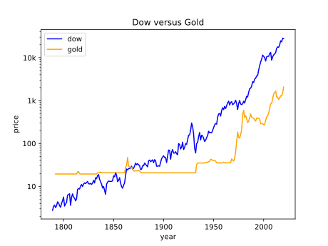
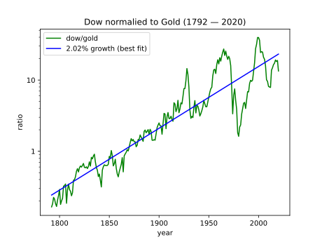

Flicker Noise Formulations in Compact Models
============================================

It is a maxim of investing that the stock market is risky but if you leave your 
money in over the long run it reliably provides the excellent returns.  `Visual 
Capitalist 
<https://advisor.visualcapitalist.com/historical-stock-market-returns>`_pegs the 
rate of return at over 8% when averaged over 200 years.  Such returns allow 
investors to beat inflation and build a nest egg if they keep their money in the 
market for decades.  But they leave one question unanswered: what are the 
expected returns adjusted for inflation.  This document attempts to get a handle 
on that.

When most people want to know the amount of inflation, they look up the CPI or 
Consumer Price Index. However, this is not a suitable measure of inflation when 
discussing investments.  The CPI measures the grown in the prices of essentials 
that are needed by the average person in their daily life, things like the cost 
of food and clothing. What we are interested in is inflation in the price of 
assets, after all one invests in assets like houses or companies, not in 
essentials like bread or socks.  The inflation in assets can be much different 
than the inflation measured by the CPI.

The best way to compensate for inflation in assets is to normalize the price of 
the asset to the price of gold. Gold is an asset and it is used primarily as 
a long term store of value as a hedge against inflation.

Here is the Dow Jones Industrial average and the price of gold over time:

As you can see the price of both assets has climbed considerably over the last 
200 years in terms of Dollars.  However, I am assuming that the value of gold 
has remained constant over time and in increase in the price of gold over time 
is due to the decrease in purchasing power of the dollar.

Now if the Dow is normalized to the price of gold we can see that true return of 
the stock market over the last 200 years:

This shows that the expected returns of the market in real terms are quite 
modest, especially when the risk and volatility of the market is considered.

Now it is important to remember that the Dow is not the market, it is just one 
segment of the market. It is convenient to use because it has been around for 
a long time. In recent years more of the growth of the market is to be found in 
other averages, such as the S&P-500 and the Nasdaq.  Including those would tilt 
the growth rate up slightly, but would also likely show that the current market 
is over-valued relative to long term averages.
