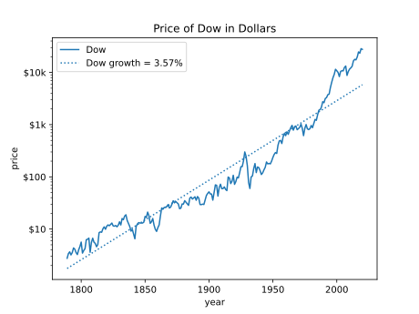
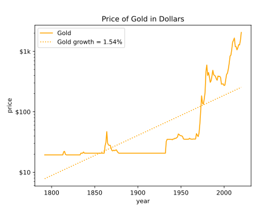
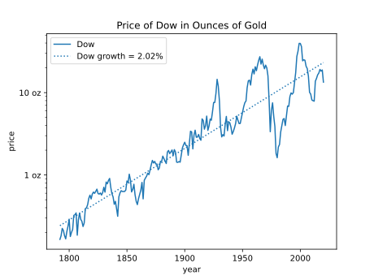
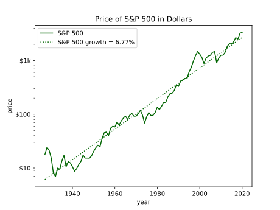
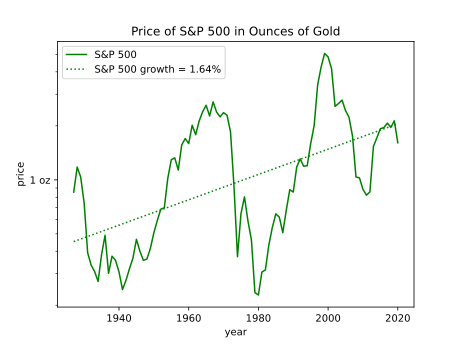
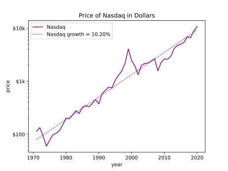
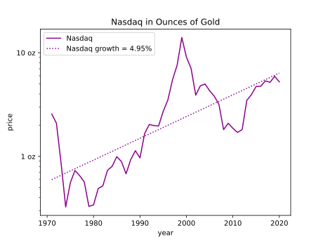
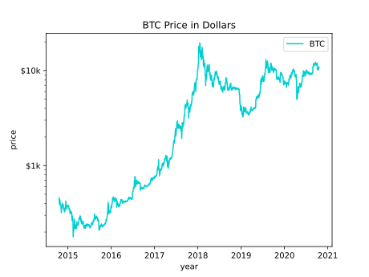

Why Invest in Bitcoin
=====================

| Author: Ken Kundert
| Version: 0.0.0
| Released: 2020-09-20
| Please post all questions, suggestions, and bug reports to
  `Github <https://github.com/KenKundert/market-returns/issues>`_.
|

True Market Returns
-------------------

It is a maxim of investing that the stock market is risky but if you leave your 
money in over the long run it reliably provides excellent returns.  `Visual 
Capitalist 
<https://advisor.visualcapitalist.com/historical-stock-market-returns>`_ pegs 
the rate of return at over 8% when averaged over the last 200 years.  Such 
returns allow investors to beat inflation and build a nest egg if they keep 
their money in the market for decades.  But they leave one question unanswered: 
what are the expected returns adjusted for inflation?  The first part of this 
document attempts to get a handle on that.  Then, from that perspective, an 
alternate investment that promises much higher returns is considered.

First, lets examine the Dow Jones Industrial Average over time.

Over the last 200 years the growth rate has averaged about 3.6%, but notice that 
the slope seems to change right around 1930, the date of the Great Depression.  
Before the depression the slope was lower and the after the slope increases.  
This occurred because of changes in policy at that time increased the amount of 
inflation in the money supply.

When most people want to know the amount of inflation, they look up the CPI or 
Consumer Price Index. However, this is not a suitable measure of inflation when 
discussing investments.  The CPI measures the growth in the prices of essentials 
that are consumed by the average person in their daily life, things like rent 
and food. What we are interested in is inflation in the price of assets.  After 
all, one invests in assets like houses or companies, not in consumables.  The 
inflation in assets can be much different than the inflation measured by the 
CPI.

The best way to compensate for inflation in assets is to normalize the price of 
the asset to the price of gold. Gold is an asset and it is used primarily as 
a long term store of value as a hedge against inflation.  It holds its value 
regardless of inflation.

As you can see the price of gold was relatively constant until the Great 
Depression, at which point it started to climb as the gold standard began to 
falter. With the dollar losing its anchor it begins to inflate in a substantial 
way.  Since 1971 when the United States finally repudiated their commitment to 
the gold standard, the average annual growth in the price of gold is 5%.  
I assume that the value of gold has remained relatively constant over time as it 
has for millennia and instead the increasing price of gold over time is due to 
the decrease in purchasing power of the dollar due to inflation.

Now, if the Dow is normalized to the price of gold we can see the true return of 
the Dow over the last 200 years.

Notice that the change is slope is gone, which supports the idea that it was due 
to inflation and that the effect of inflation can be removed by normalizing to 
the price of gold.  The true rate of return is determined to be 2%, which seems 
to be quite modest especially considering the risk and volatility of the market.  
Also notice that after the Great Depression the volatility of the market has 
substantially increased.  The increase in volatility is directly due to the 
increased inflation as it is inflation that creates and aggravates business 
cycles.

Now it is important to remember that the Dow is not the market, it is just one 
segment of the market. It is convenient to use because it has been around for 
a long time. In recent years more of the growth of the market is to be found in 
other averages, such as the S&P 500 and the Nasdaq.

Consider the S&P 500.

In this case the apparent return is 6.8%. However, when inflation is removed ...

the true return is found to be an even more modest 1.6%.

Finally, consider the Nasdaq.

The return in terms of dollars is found to be 10.2%.

With inflation removed, the true return is revealed to be 5%, which is better 
than the others, but volatility is even greater.

What this shows is that one must carefully consider inflation when looking at 
long-term expected returns in the market.  The true returns are considerably 
less that what are generally promised, which of course is very important to 
understand when planning for the long term.  These returns also come with 
substantial volatility, which can be hugely problematic. Imagine investing 
a substantial amount of money into the S&P 500 in 1927 for a planned retirement 
in 1980 only to find that after 50 years it only has one fifth the value in real 
terms of what you originally invested.

Now, consider an asset that promises to be more rewarding and, if widely 
adopted, solves the inflation problem by simply eliminating inflation.

Bitcoin
-------

To understand bitcoin it important to understand that today bitcoin is more of 
of an asset than an currency, and the value of almost all assets is based on 
their scarcity.  This did not used to be true with equities in the stock market.  
Many years ago the holders of equities were rewarded with dividends, meaning 
that it was worthwhile to hold the stocks even if the price of the stock did not 
change.  But over time things changed and now the rewards from holding stock 
usually come from price appreciation rather than from dividends.  For the price 
of stock to appreciate, the shares must be in demand and they must be scarce.  
The fewer the shares, the larger the fraction of ownership of the company that 
each share represents.  Indeed, the current run up of the stock market is due at 
least in part to stock buy backs. Buy backs increase the scarcity of the shares, 
increasing their value.  Conversely, companies can issue new shares, which tends 
to reduce the value of all shares.

All desirable assets combine demand with scarcity. I mention this because many 
people question bitcoin's validity as an asset.  But bitcoin provides tremendous 
value, which drives demand, and is the only asset available whose supply cannot 
be intentionally inflated, as such its scarcity is guaranteed.  At this point 
the importance of its value is not widely recognized.  As such, it represents an 
investment opportunity.  As the importance of bitcoin becomes more widely 
understood, its price will increase.

Briefly, the value that bitcoin offers is as an efficient means of transferring 
money over the internet. It is controlled by a decentralized network with 
a transparent set of rules, thus presents an alternative to central bank 
controlled fiat money. The decentralized nature of bitcoin is its most unique 
and important feature.  It makes it difficult if not impossible for governments 
and banks to stop it or to interfere with individuals use of their money.  In 
addition, bitcoin has guaranteed scarcity. No one can decide to issue more 
bitcoin in the future.  Unlike fiat currencies, bitcoin is not subject to 
devaluation due to an inflating supply.  For these reasons, bitcoin is superior 
money and is now competing on the open market with government mandated 
currencies that lose value over time.  In the last 50 years the US dollar has 
been losing roughly 5% of its value every year.  Once people begin to recognize 
that bitcoin is superior money and is available to them, they will begin to 
switch. Since bitcoin is scarce, the increasing demand causes bitcoin to 
increase in value, which encourages more to switch.  This positive feedback 
suggests that once a threshold is reached, the transition to bitcoin will be 
swift, which will result in a rapid and dramatic increase in the value of each 
bitcoin.  This positive feedback is part of the network effect that is common to 
many of the hugely valuable monopolies that currently exist, such as Google, 
Facebook, etc.  Those that own bitcoin and hold it through the transition can 
expect to benefit handsomely, just like the insiders that were able to get into 
Google and Facebook early.

To understand the potential of bitcoin, realize that 21M is the maximum number 
of bitcoin that will ever exist.  Currently (September 2020) there are 18.5M.  
I will approximate both of these numbers as 20M.  The current price is $10k, 
meaning that the total value of all bitcoin is roughly $200G. Estimates for the 
total amount of dollars in the world economy is very roughly $200T. Thus, for 
bitcoin to replace the dollar the total number of bitcoin must represent that 
$200T, meaning that in doing so each bitcoin eventually becomes worth $10M.
This represents a 1000× increase. To get the same return by investing in the 5% 
growth rate of the Nasdaq would require 140 years. 

If you look at the investment alternatives to bitcoin, you find things like 
stock, real estate, and gold.  However, all the alternatives that you know about 
today have already run up in value. For example, consider Apple. The total value 
of Apple stock is $2T. A great company, but just how much greater can it become?  
To exhibit a 1000× increase, it would have to become substantially larger than 
the entire world's economy.  Apple has been a great stock to own in the past, 
but now its growth is limited; it is near the end of its range.  What is unusual 
about bitcoin is that it is at the beginning of its range. In its 10 years of 
life it has proven itself by remaining completely reliable while producing 
a tremendous run up in value.  However, at 0.1% of its $200T total available 
market, it is still quite small.  It also benefits from the network effect, 
which causes it both to grow quickly and repel competitors.  Bitcoin currently 
represents an unprecedented opportunity for those that see it and seize it.

Displace the Dollar? Really?
----------------------------

The dollar will not go quietly. Owning the worlds reserve currency is an 
'exorbitant privilege' that allows the US to push its expenses off on to the 
entire world. The US has aggressively defended the dollar against gold for 
a long time.  However, this battle with gold has depleted the US resources.  
Specifically, the US has secretly sold off much of its gold reserves in order to 
undermine gold, keeping its price artificially low. It has not been completely 
successful. While there are no countries still on the gold standard, other 
countries hold assets other than the dollar to make up their reserves; including 
gold and the currencies of other countries.

However, the tactics that the US used to undermine gold will not work nearly as 
well against Bitcoin.

When gold started to increase in value the US would dump gold on to the market 
to damp its rise and discourage its use.  This reduced the US gold reserves, 
which also acts to undercut the rationale for using the dollar as a reserve 
currency.  The US is currently trying to hide this situation by refusing to 
allow its gold reserves to be audited.

This strategy cannot be used against bitcoin because the US does not hold 
a significant amount of bitcoin, and if they tried to acquire a substantial 
amount of bitcoin, it would increase the value of bitcoin, making it stronger.

The US put significant political and financial pressure on Switzerland in order 
to force it to give up the gold standard, which was a huge symbolic victory.

This strategy will be less effective against bitcoin. There are currently no 
countries that use bitcoin as its official currency, so there are no countries 
to target.  These tactics could be applied against corporations, but 
corporations likely have enough political influence in Washington to undercut 
those tactics.

Bitcoin itself is impervious to political pressure because it is decentralized.  
There is nobody to pressure.

The dollar was established as the world's reserve currency in the aftermath of 
World War II, when the US was at the peak of its financial power. That primacy 
has eroded considerably since, which weakens the currency. Furthermore, other 
financial powers are souring on the US use of its exorbitant privilege.  The US 
is increasingly aggressive at using its control of the worlds financial system 
to punish other countries.  Even its European allies are being increasingly 
threatened with sanctions.  China is currently building up its gold reserves and 
may be thinking of taking a run at knocking the dollar off its perch.  It has 
tremendous incentive to do so. If the dollar can be displaced as the world's 
reserve currency, then the US loses the exorbitant privilege that it uses to 
finance its out-sized military, giving China a clear path to becoming the 
dominant world power.

While the dollar is losing favor as the world's reserve currency, there is no 
obvious replacement available.  Without a dominant currency, world trade becomes 
harder and more expensive. There will be a strong desire to find a mutually 
acceptable replacement.  No country likes the idea of that replacement being 
bitcoin. Authoritarian countries especially do not like the loss of control that 
accompanies the widespread adoption of bitcoin. However, moving to bitcoin is 
probably still more palatable than staying on the dollar or moving to the 
currency of an economic or political adversary. At least bitcoin is neutral and 
does not advantage their competitors.

Currently bitcoin is too small to be of much use to nation states. Rather, it 
is largely used by individuals. However, there is increasing evidence that it is 
now being adopted by corporations. For example, `MicroStrategy 
<https://news.bitcoin.com/nasdaq-microstrategy-bitcoin-425-million/>`_ just 
moved $425M, the bulk of its financial reserves, into bitcoin. The increased 
adoption reduces volatility and increases price.  There is a strong advantage to 
those like MicroStrategy that move early, so the transition is likely to be 
rapid.  There is currently $5T in the reserves of publicly traded companies.  If 
half of that moves into bitcoin its price will rise by at least an order of 
magnitude.  Once the price increases by that much, bitcoin becomes large enough 
to be interesting and useful to nation states.  At that point the first-mover 
advantage comes into play again, but this time for countries, driving adoption 
by nation states.

The decentralized nature of bitcoin makes it an uncomfortable opponent for 
governments.  Governments create laws and then obtain compliance by threatening 
to punish individuals or corporations that violate their laws. Their favored 
targets are the leaders or owners, but with bitcoin there is often no leaders or 
owners to target.  You can see the nervousness with which governments view 
cryptocurrency by their reaction to Libre.  They would like cryptocurrencies to 
go away, but with bitcoin they don't know how to make that happen. However with 
Libre they had a centralized opponent and they were seemingly quite effective at 
knocking it back.

At this point it is hard to see how any one country could stop bitcoin.  India 
has tried to outlaw bitcoin and has been largely ineffective.  The bitcoin 
network communicates using encrypted connections that are virtually impossible 
to block, so as long as one has an internet connection, one can access it.  
Outlawing bitcoin prevents bitcoin businesses from developing, but does not stop 
individuals from transacting with bitcoin.  If a country does somehow succeed in 
outlawing bitcoin, the bitcoin network still survives in other countries and the 
likelihood of the adoption of bitcoin by the rest of the world would be largely 
ineffective.

The adoption by the financial industry and by corporations further reduces the 
risk of countries trying to outlaw bitcoin. It makes bitcoin look less like 
a threat and more like just another asset.  It also means that countries will 
harm their economies if they make it harder to use bitcoin.

The fundamental issue for the fiat currencies is their ever increasing supply.  
If you hold an investment in a fiat currency it loses value over time.  
Specifically, an investment in dollars loses %5 per year, which is huge. How do 
you avoid this loss?  You have to move your money into an asset. That asset 
could be stock, but stock is volatile and can involve significant risk.  It 
could be gold; many do this.  Soon it will be bitcoin. Currently bitcoin is hard 
for most people to buy. You need accounts at special exchanges. Also, bitcoin 
shares the volatility of stock. But over time the ease of use for bitcoin will 
increase dramatically and the volatility will drop. Finally, the growth 
potential of bitcoin dwarfs that of gold or stocks, which is what will drive its 
adoption.

The only way for governments to stop the rise of bitcoin is to stop inflating 
the supply of their fiat currencies.  That inflation is the fuel that pushes 
people to bitcoin.  The people that control the fiat currencies have learned 
that by printing money they can get something for nothing, so it is highly 
unlikely that this behavior will change on its own. In fact, the only thing that 
will change this behavior is competition from bitcoin itself.  Given a choice, 
governments do not allow competition with their currency.  However, the 
decentralized nature of Bitcoin makes it impossible for governments to stop.  
Thus bitcoin provides, whether governments like it or not, a free market in 
currency.  Once bitcoin is established, people can freely choose between bitcoin 
or the fiat currency. Once people start choosing the bitcoin, those that control 
the fiat currencies, the central banks, are forced to change their ways, 
otherwise their currencies will become irrelevant.  Thus, the competition forces 
fiat currencies to become more like bitcoin, which might stop bitcoin from 
completely replacing the fiat currency. However, the competition only becomes 
effective when bitcoin becomes much larger. Bitcoin is simply too small at the 
moment to change the behavior of central banks, but if it becomes 50-100× larger 
it starts to threaten fiat currencies and so the central bankers must react to 
bitcoin. They start to compete with bitcoin by lowering the inflation in their 
currencies to negligible levels. That slows the growth of bitcoin, but at that 
point bitcoin has already grown substantially. Thus, even if bitcoin does not 
completely replace the dollar, its price should grow to at least 10× and more 
likely 100× its current value before central banks react.  Investing in bitcoin 
will be tremendously rewarding even it never completely displaces the dollar.

Bitcoin Is Unique
-----------------

Many people wonder why it is that bitcoin will be the winner. After all there 
are many cryptocurrencies, many claiming to be faster and smarter. But bitcoin 
is unique in that it is the most decentralized. Unlike all other 
cryptocurrencies, the creator of bitcoin, the anonymous Satoshi Nakamoto, 
disappeared after bitcoin started gaining momentum.  Nobody that remains 
involved in bitcoin development has the political clout to control development.  
Instead everything is done by consensus. The result is that while it is possible 
to make enhancements that are widely recognized as upgrades, it is virtually 
impossible to make substantial changes that are at all controversial.  A change 
in the issuance schedule would be hugely controversial, and so it is not 
possible to change it.  As such, the hard-money aspects of bitcoin are 
unassailable. It is the only currency that you can count on to hold the value of 
your investment.  With all other currencies the creator has enough control to 
step in make changes that result in loss of value, as central banks do with fiat 
currencies today.  Even if such a competing hard-currency were to be created, 
bitcoin has a staggering lead.  It owns most of the market share, it has by far 
the largest market capitalization, and it owns the lion's share of the miners. 
The network effect virtually guarantees bitcoin will remain the dominant 
cryptocurrency.

The way to think about this is that of all available cryptographic tokens, only 
a few aspire to be assets, and of those bitcoin obvious winner.  The other 
tokens are utility tokens that are focused on solving some problem other than 
being a store of value.

How Is This Going to Work?
--------------------------

Currently most Americans are unaware of the problem of asset inflation. The 
Federal Reserve have trained people to believe that inflation is measured with 
the CPI. As such, most people are simply unaware that each good has its own rate 
of inflation and most are not included in the CPI. Most important of those is 
the inflation in assets which has averaged 5% per year for 50 years. This 
explains why more and more people find that long-term financial security 
slipping farther and farther away.  Only the most sophisticated recognize that 
keeping their financial reserves in cash and dollar-based assets like government 
bonds results in their nest egg slowly melting away.  Those individuals and 
companies are actively moving to bitcoin for capital preservation.  Adoption by 
those people is slowly driving up the price, which is causing others to consider 
bitcoin as a growth investment.

As people slowly recognize that bitcoin is a good investment and acquire some 
the price goes up and so they acquire more. Those holdings increase in value 
until soon they, and others, have significant amounts of bitcoin.  Vendors 
recognize that their customers are holding a lot of bitcoin, so they make it 
easy for people to pay in bitcoin. Other companies recognize an opportunity in 
making it easier to acquire and spend bitcoin. Credit card companies recognize 
that transferring money using bitcoin is faster and cheaper than using dollars, 
and is not subject to the rules and restrictions of various jurisdictions.  
Thus, once people begin to hold bitcoin as a store of value, the bitcoin 
ecosystem naturally develops, which causes bitcoin to take on more of the 
attributes of currency.  Once bitcoin can do everything the dollar can do, but 
better, it sets about displacing the dollar altogether.

Those waiting for bitcoin to develop a fantastic payment system before adopting 
it are making a mistake. Instead they should invest in bitcoin, and in doing so 
they will help bitcoin develop a fantastic payment system. And they will make 
a bunch of money while they are waiting.

Recommendation
--------------

My advice to everyone is to get at least one bitcoin and hold on. A single 
bitcoin currently represents a modest investment of $10k.  But if bitcoin does 
replace the dollar, that small investment could provide enough money to secure 
your future.  Get one for you, one for your spouse, and one for each of your 
kids to secure all their futures.

In addition I recommend shifting excessive cash holdings into Bitcoin.  Don't 
believe the CPI myth, cash is losing value at a rate of 5% per year.

Comments and News
-----------------

6 October 2020
""""""""""""""
Recent `news 
<https://bitcoinist.com/bitcoin-analyst-reveals-whats-holding-price-above-10k-its-china>`_
indicates that in a significant change from the past, China's state media has 
adopted a positive posture towards bitcoin.

China has been accumulating gold for some time.  Rumors are that they may have 
as much as 20,000 tons. The US claims to have 8,000 tons and that might be 
overstated.  China has announced that they are developing a digital currency.
This could be devastating for the dollar. The dollar was adopted as the world's 
reserve currency after WWII when the US had roughly 20,000 tons of gold to back 
the dollar. If China has accumulated more gold than the US, then the digital 
renminbi suddenly becomes a safer choice as a reserve currency. But the US still 
controls the worldwide financial payment systems. If China can get its digital 
currency established, then suddenly there is an alternative system that is 
completely outside of US control, further undermining the dollar.

So why is China suddenly positive about bitcoin? My speculation is that China is 
not confident that nations will switch from one fiat reserve currency to 
another, especially now that a viable alternative exists, so they are hedging 
their bets.  From China's perspective, a decentralized reserve currency like 
bitcoin is not desirable because it cannot be controlled, but it is much better 
than a US controlled reserve currency, and with their tight control on their own 
economy, they may feel comfortable they can prevent if from being adopted for 
day to day spending with China.  The other reason they have adopted a positive 
attitude towards bitcoin is that they may be accumulating it to further beef up 
their reserves.  As I mentioned previously, there is a tremendous first mover 
advantage in doing so.  If China and its population can accumulate a large 
amount of bitcoin, they can establish it as an accepted reserve asset. Then as 
other countries catch on and try to accumulate their own bitcoin, their actions 
makes China richer, further establishing it as the dominant financial power.

8 October 2020
""""""""""""""
In another example of a company shifting its assets to bitcoin, Square has 
invested $50M into bitcoin, or about 1% of Square's total assets.

In recent weeks the price of bitcoin has been remarkably stable, hovering in the 
range $10.5k to $11k.  This may be an indication that large players are buying 
large amounts. When MicroStrategy bought $500M in bitcoin, it set a price and 
then bought whenever the price dropped below that price. This acts to set 
a lower bound for the price during the duration of the buy.
